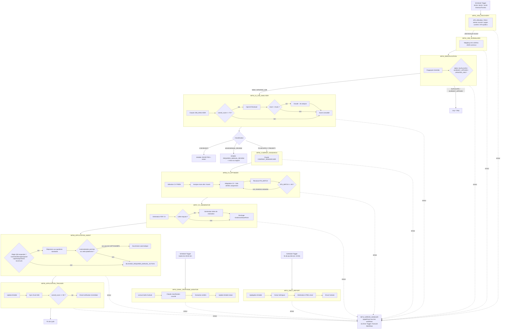

# Diagramme des workflows

## 1. Diagramme global (Mermaid)

## 2. Table de correspondance workflow ↔ déclencheur

| Workflow | Déclencheur | Fréquence |
|---|---|---|
| WF01_JOB_DISCOVERY | Schedule Trigger | 00:00, 08:00, 16:00 America/Toronto |
| WF02_JOB_NORMALIZER | Execute Workflow (appelé par WF01) | à chaque exécution WF01 |
| WF03_DEDUPLICATION | Execute Workflow (appelé par WF02) | à chaque exécution WF02 |
| WF04_AI_JOB_ANALYZER | Execute Workflow (appelé par WF03, offres NEW/UPDATED_JOB) | à chaque offre |
| WF05_COMPANY_RESEARCH | Execute Workflow (appelé par WF04, score ≥70) | à chaque offre qualifiée |
| WF06_CV_OPTIMIZER | Execute Workflow (appelé par WF05) | à chaque offre qualifiée |
| WF07_CV_GENERATOR | Execute Workflow (appelé par WF06) | à chaque offre qualifiée |
| WF08_APPLICATION_AGENT | Execute Workflow (appelé par WF07) | à chaque offre qualifiée |
| WF09_APPLICATION_TRACKER | Execute Workflow (appelé par WF08) | à chaque candidature/blocage |
| WF10_EMAIL_RESPONSE_MONITOR | Schedule Trigger | toutes les 30-60 min |
| WF11_DAILY_REPORT | Schedule Trigger | 1x/jour, ex. 22:00 America/Toronto |
| WF12_ERROR_HANDLER | Error Trigger / Execute Workflow (sous-workflow) | sur erreur, depuis n'importe quel workflow |

## 3. Convention d'appel entre workflows

Tous les appels inter-workflows utilisent le node **Execute Workflow** (mode "Define below" avec
l'ID du workflow cible, ou "From list") et passent un objet JSON unique par item en entrée/sortie,
conforme au schéma commun (§15 du prompt utilisateur). Chaque sous-workflow commence par un node
**Execute Workflow Trigger** et retourne son résultat via un node **NoOp** nommé
`Return_To_Caller` (dernier node), afin que le workflow appelant reçoive directement les données.
